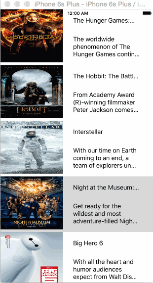

# RottenTomatoes Box Office Demo

(Sample of your weekly project submission README)

This is an iOS demo application for displaying the latest box office movies using the [RottenTomatoes API](http://www.rottentomatoes.com/). See the [RottenTomatoes Networking Tutorial](http://guides.thecodepath.com/android/RottenTomatoes-Networking-Tutorial) on our cliffnotes for a step-by-step tutorial.

Time spent: 4 hours spent in total

Completed user stories:

 * [x] Required: User can view a list of movies from Rotten Tomatoes. Poster images must be loading asynchronously.
 * [x] Required: Must use Cocoapods.
 * [x] Required: Asynchronous image downloading must be implemented using the UIImageView category in the AFNetworking library.

Walkthrough of all user stories:

GIF created with [LiceCap](http://www.cockos.com/licecap/).
